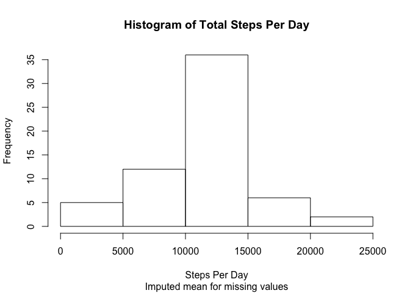

# Reproducible Research: Peer Assessment 1


## Loading and preprocessing the data
  
Set the working directory, first making sure it exists  


```r
  workingDirectory <- paste("~/Box Sync/Coursera-data-science/",
          "datasciencecoursera/Reproducible_Research/RepDa",
          "ta_PeerAssessment1",
          sep="")
  
  if (dir.exists( workingDirectory) != TRUE) {
    stop(sprintf("%s is not accessible as a directory.", 
                 workingDirectory))
  }
  
  # set working directory
  
  setwd(workingDirectory)
```
  
   Now download and unzip the data  
   

```r
  dataURL <-
   "https://d396qusza40orc.cloudfront.net/repdata%2Fdata%2Factivity.zip"
  
    # download zip file
  download.file(url=dataURL,
                destfile="tmp.zip",
                method="curl",
                mode="wb")
  
  # make sure the zip file downloaded correctly
  if ( file.exists("tmp.zip") != TRUE) {
    stop(sprintf("Download failed.\nURL: %s\nWorking directory: %s",
                 dataURL,
                 getwd()))
  }
  
  # extract data files
  unzip("tmp.zip")        
  
  # make sure file extracted correctly
  if ( file.exists("activity.csv") != TRUE) {
    stop(sprintf("activity.csv is not present in %s",
                 getwd()))
  }
  
  # delete the zip file; it is no longer needed.
  if ( file.exists("tmp.zip") == TRUE) {
    file.remove("tmp.zip")
  }

  ## Read the CSV file into a vector
  tRawActivities <- read.csv("activity.csv")
```

## What are the mean and median total number of steps taken per day?
 
   
  First, get the sums of steps per day.  
  

```r
  tSplitByDay <- split(tRawActivities,tRawActivities$date,drop=TRUE)
  tStepsByDay <- sapply(tSplitByDay, function(x) {sum(x$steps)})
```
  
  Next, do a histogram:
  

```r
    hist(tStepsByDay,main = "Histogram of Total Steps Per Day",xlab = "Steps Per Day")
```

\

  Then calculate the mean...  
  

```r
  mean(tStepsByDay,na.rm = TRUE)
```

```
## [1] 10766.19
```
  
  ... and the median.
  

```r
  median(tStepsByDay,na.rm = TRUE)
```

```
## [1] 10765
```

## What is the average daily activity pattern?

Prepare a time series plot of the mean steps by day:  


```r
  tMeanStepsByDay <- sapply(tSplitByDay, function(x) {mean(x$steps)})
  
  daynums <- seq(1,length(tMeanStepsByDay))
  
  plot(daynums,tMeanStepsByDay,
        xlab = "Day Number",
        ylab = "Mean Steps",
        main = "Time Series Plot of Mean Steps By Day",
       type="l")
```

\

  
    
## Imputing missing values

### A naive approach demonstrated

  Note that missing values result in gaps in the time series. We can make the lines continuous by imputing zero values:
  


```r
  tMeanStepsByDayImputedZero4NAs <-  impute(tMeanStepsByDay,0)

  plot(daynums,tMeanStepsByDayImputedZero4NAs,
        xlab = "Day Number",
        ylab = "Mean Steps",
        main = "Time Series Plot of Mean Steps By Day",
        sub = "(Imputed Zero for NA values)",
       type="l")
```

\

  
  Although this makes the plot tidyer by connecting the lines, replacing missing values with zeroes is not a very intelligent approach to the missing-values problem. Let's go back to the original data set and replace missing values with daily mean values. This is only a bit more intelligent, given the wide variation in number of steps during the daily intervals, but then, this assignment is already late and my "R" skills are rusty, so let's go with what is easy.  
  
  But before we do that, let's see what the proportion of missing values to complete cases looks like.
  
### Assessing the proportion of missing values
  
  

```r
  ## count complete cases
  nValuesNAvsNotNA <- complete.cases(tRawActivities)
  nMissingValues <- length(nValuesNAvsNotNA[nValuesNAvsNotNA==FALSE])
  nNotNAs <- length(nValuesNAvsNotNA[nValuesNAvsNotNA==TRUE])
```

Complete cases:  


```r
  nNotNAs
```

```
## [1] 15264
```


Missing values:  


```r
  nMissingValues
```

```
## [1] 2304
```


We'll put it in a histogram to make the contrast more vivid.  


```r
  barplot(table(nValuesNAvsNotNA),
          main ="Cases where Values Missing vs Present",
          xaxt="n",
          ylab = "Frequency")
  axis(side=1,
       tick=FALSE,
       labels = c("Value Missing","Value Present"),
       at = c(.68,1.89))
```

\

### Imputing the mean for missing values

Now let's see what happens when we plug up the holes in our data set.  


```r
  tActivityWithImputedMean <- tRawActivities
  tActivityWithImputedMean$steps <- 
      impute(tActivityWithImputedMean$steps, 
             mean(tRawActivities$steps,na.rm=TRUE))
  tSplitByDayWithImputedMean <- split(tActivityWithImputedMean,
                                      tActivityWithImputedMean$date,
                                      drop=TRUE)
  tStepsByDayWithImputedMean <- sapply(tSplitByDayWithImputedMean, 
                                       function(x) {sum(x$steps)})
```
  
New mean is the same as the original with missing values removed:  


```r
  mean(tStepsByDayWithImputedMean)
```

```
## [1] 10766.19
```

  
New median is now equal to the mean, where before it was just very close:  


```r
  median(tStepsByDayWithImputedMean)
```

```
## [1] 10766.19
```
  
New histogram looks about the same, but...  


```r
    hist(tStepsByDayWithImputedMean,
         main = "Histogram of Total Steps Per Day",
         xlab = "Steps Per Day",
         sub = "Imputed mean for missing values")
```

\


...whereas the bars remain proportional, the frequency scale has now increased.  

The lesson from this: This method of imputing missing values adds very little meaningful new information to our investigation.

## Are there differences in activity patterns between weekdays and weekends?

Now we will see if people take more steps on Saturdays and Sundays.  

First we do some fancy footwork to classify dates into weekdays (Mon-Fri) and weekends (Sat-Sun).


```r
  tActivityWithImputedMean$weekdays <- 
      weekdays(as.Date(tActivityWithImputedMean$date), 
                         abbreviate = TRUE)
  tActivityWithImputedMean$work.or.play <- "weekday"
  tActivityWithImputedMean$work.or.play[tActivityWithImputedMean$weekdays=="Sat"] <- "weekend"
  tActivityWithImputedMean$work.or.play[tActivityWithImputedMean$weekdays=="Sun"] <- "weekend"
```

Next we compute the number of steps per 5-minute interval for each of the two types of days.  

First weekdays...  


```r
  tWeekdaySteps <- subset(tActivityWithImputedMean,
                          tActivityWithImputedMean$work.or.play=="weekday")
  
  tSplitByIntervalOnWeekday <- split(tWeekdaySteps,
                                     tWeekdaySteps$interval,
                                     drop=TRUE)

  tStepsByIntervalOnWeekday <- sapply(tSplitByIntervalOnWeekday, function(x) {sum(x$steps)})

  weekday.intervals <- seq(1,length(tStepsByIntervalOnWeekday))
```

...and then weekends.  


```r
  tWeekendSteps <- subset(tActivityWithImputedMean,
                          tActivityWithImputedMean$work.or.play=="weekend")
  
   tSplitByIntervalOnWeekend <- split(tWeekendSteps,
                                     tWeekendSteps$interval,
                                     drop=TRUE)

  tStepsByIntervalOnWeekend <- sapply(tSplitByIntervalOnWeekend, function(x) {sum(x$steps)})

  weekend.intervals <- seq(1,length(tStepsByIntervalOnWeekend))
```
  
Now we show the two time series plots, stacked.  


```r
  par(mfrow=c(2,1))  
  plot(weekend.intervals,tStepsByIntervalOnWeekend,
        xlab = "Interval",
        ylab = "Mean Steps",
        main = "Time Series Plot of Mean Steps By Interval on Weekends",
       type="l")
  plot(weekday.intervals,tStepsByIntervalOnWeekday,
        xlab = "Interval",
        ylab = "Mean Steps",
        main = "Time Series Plot of Mean Steps By Interval on Weekdays",
       type="l")
```

\

From this we can draw the following tentative conclusions:  

- People don't exercise in the middle of the night, regardless of day type (intervals 1-75, roughly).
- On weekdays, people start exercising earlier, on average (intervals 75-100).
- On both weekdays and weekends, the peak intervals are early in the daytime (intervals 100-125), but on weekends the remainder of the day shows more people exercising than on weekdays. 
- This is as expected, since weekday daytime is when the vast majority of people are at work, and work is becoming increasingly sedentary among the kind of people who can afford and choose to wear fitness devices.
